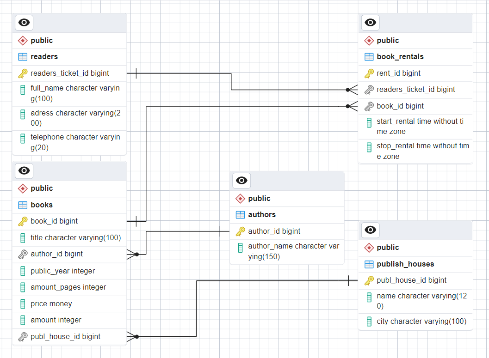
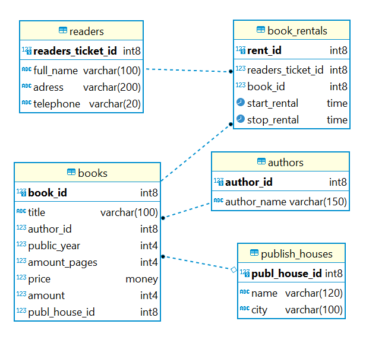

## 1. Графическая структура базы данных:

## 2. 
### SQL-скрипт для создания таблиц:
Файл: [DDL-script](db/DDL/1_ddl.sql)

### SQL-скрипт для заполения таблиц:
Файл: [DML-script](db/DML/2_dml.sql)

## 3. Файл Docker-compose:
Файл: [Docker-compose](docker-compose.yml)

## Для развертывания базы "Библиотека" необходимо:
1. Скачать архив из репозитория;
2. Распаковать в нужную папку;
3. В терминале перейти в папку с базой данных и выполнить команду <u>***docker-compose up -d --build***</u>
4. Запустить DBeaver, ввести наименование базы данных, логин и пароль.
5. Ваша база данных "Библиотека" перед Вами!

